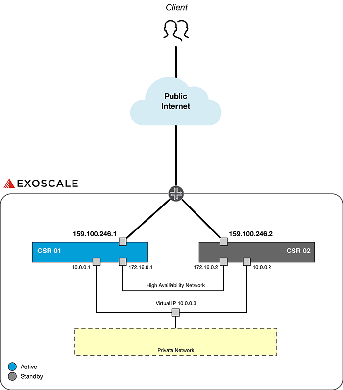

# Deploy a Cisco CSR 1000V Cluster on Exoscale

* [Requirements](#requirements)
* [Introduction](#introduction)
* [Basic Configuration](#basicconfig)
	- [Enable DHCP](#enablessh)
	- [Enable SSH](#enablessh)
	- [Add User](#adduser)
	- [Enable HSRP](#enablehsrp)
	- [Check the Standby Status](#checkstandby)
* [Site-to-Site VPN Configuration](#basicconfig)


## Requirements

* You have access to the [Exoscale Portal](https://portal.exoscale.com)
* You're familiar with Cisco in general and the CSR 1000V in specific. If not, start with [Cisco Configuration Guide](https://www.cisco.com/c/en/us/td/docs/routers/csr1000/software/configuration/b_CSR1000v_Configuration_Guide.html) or contact [A1 Digital](mailto:vendors.security@a1.digital)
* You have valid licenses for your Cisco CSR 1000V instances
* You're familiar with Linux command line tools and scripting
* You already have some private networks defined on Exoscale you want to make available

## Introduction

This deployment guide intents to describe how to achieve a CSR HA setup consisting of two CSR 1000V nodes. This cluster can be used to provide a highly available secure access to backend servers, which are not publicy available, through an encrypted connection. Below you can see a network chart of such a deployment.



In the example architecture we use the following networks:

* Public network for client traffic coming from the Internet
* Private network ```172.16.0.0/24``` for cluster communication
* Private network ```10.0.0.0/24``` for backend server connectivity

The backend servers can, but must not use the virtual IP ```10.0.0.3``` as their default gateway for connecting to the internet. 

## Basic Configuration
### 1. Enable DHCP

```bash
csr(config)# hostname csr1
csr1(config)# interface gigabitEthernet 1
csr1(config-if)# ip address dhcp
``` 

### 2. Enable SSH

```bash
(config)# hostname asr1
(config)# ip domain-name localhost.localdomain
(config)# crypto key generate rsa
(config)# enable secret cisco
(config)# service password-encryption
(config)# line vty 0 4
(config-line)# transport input ssh
(config-line)# login local
(config-line)# password 0 cisco
(config-line)# logging synchronous
(config-line)# login local
```

### 3. Add User

```bash
(config)# username cisco password cisco
(config)# username cisco privilege 15
```

### 4. Enable HSRP
#### Primary node

This is the offication Cisco CSR 1000V [First Hop Redundancy Protocols Configuration Guide](https://www.cisco.com/c/en/us/td/docs/ios-xml/ios/ipapp_fhrp/configuration/xe-16/fhp-xe-16-book/fhp-hsrp.html).

```bash
csr1(config)# interface gigabitEthernet 2
csr1(config)# ip address 172.16.0.1 255.255.255.0
csr1(config)# standby 1 ip 172.16.0.3
csr1(config)# standby 1 priority 150
casr1(config)# standby 1 preempt delay minimum 5 reload 10
csr1(config)# standby use-bia

csr1(config)# interface gigabitEthernet 3
csr1(config)# ip address 10.0.0.1 255.255.255.0
csr1(config)# standby 1 ip 10.0.0.3
csr1(config)# standby 1 priority 150
csr1(config)# standby 1 preempt delay minimum 5 reload 10
csr1(config)# standby use-bia
```

#### Secondary node

```bash
csr2(config)# interface gigabitEthernet 2
csr2(config)# ip address 172.16.0.2 255.255.255.0
csr2(config)# standby 1 ip 172.16.0.3
csr2(config)# standby 1 priority 10
csr2(config)# standby 1 preempt delay minimum 5 reload 10
csr2(config)# standby use-bia

csr2(config)# interface gigabitEthernet 3
csr2(config)# ip address 10.0.0.2 255.255.255.0
csr2(config)# standby 1 ip 10.0.0.3
csr2(config)# standby 1 priority 10
csr2(config)# standby 1 preempt delay minimum 5 reload 10
csr2(config)# standby use-bia
```

### 5. Check the Standby Status

```bash
csr1# show standby
```

## Site-to-Site VPN Configuration

A VPN tunnel can be configured as shown in this official [Cisco guide](https://www.cisco.com/c/en/us/td/docs/ios-xml/ios/sec_conn_vpnips/configuration/xe-3s/sec-sec-for-vpns-w-ipsec-xe-3s-book/sec-cfg-vpn-ipsec.html).

## Additional Notice

Please check all script entries of their correctness. The IDs and names used here in the guide are also carefully checked for accuracy. If you have any questions or comments about this guide, please contact [A1 Digital](mailto:vendors.security@a1.digital).
