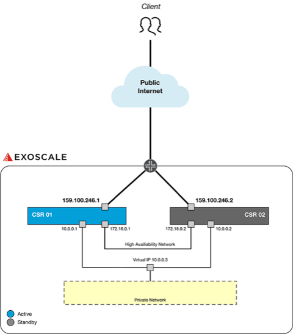

# Deploy a Cisco CSR Cluster on Exoscale

* [Requirements](#requirements)
* [Introduction](#introduction)
* [Deployment Guide](#deployment)
	- [Prepare API Client](#prepareapiclient)
	- [Register a Custom Template on Exoscale](#registertemplate)
* [Basic Configuration](#basicconfig)
	- [Enable SSH](#enablessh)
	- [Add User](#adduser)
	- [Enable HSRP](#enablehsrp)
	- [Check the Standby Status](#checkstandby)

## Requirements

* You have access to the [Exoscale Portal](https://portal.exoscale.com)
* You're familiar with Cisco CSR 1000V. If not, start with [Cisco Configuration Guide](https://www.cisco.com/c/en/us/td/docs/routers/csr1000/software/configuration/b_CSR1000v_Configuration_Guide.html) or contact [A1 Digital](mailto:vendors.security@a1.digital)
* You have valid licenses for your Cisco CSR 1000V instances
* You're familiar with Linux command line tools and scripting
* You already have some private networks defined on Exoscale you want to make available

## Introduction

This deployment guide intents to describe how to achieve a HA VPN setup for a branch office to a cloud infrastructure. The intention is to securely access backend servers, which are not publicy available, through an encrypted connection. Below you can see a network chart of such a deployment.

## Basic Configuration
### Enable DHCP

csr(config)#hostname csr1

csr1(config)#interface gigabitEthernet 1

csr1(config-if)# ip address dhcp

### Enable SSH

(config)# hostname asr1

(config)# ip domain-name localhost.localdomain

(config)# crypto key generate rsa

(config)# enable secret cisco

(config)# service password-encryption

(config)# line vty 0 4

(config-line)# transport input ssh

(config-line)# login local

(config-line)# password 0 cisco

(config-line)# logging synchronous

(config-line)# login local

### Add User

(config)# username cisco password cisco

(config)# username cisco privilege 15

### Enable HSRP
#### Primary node

This is the offication Cisco CSR 1000V [First Hop Redundancy Protocols Configuration Guide](https://www.cisco.com/c/en/us/td/docs/ios-xml/ios/ipapp_fhrp/configuration/xe-16/fhp-xe-16-book/fhp-hsrp.html).

asr1(config)#interface gigabitEthernet 2

asr1(config)#ip address 172.16.0.1 255.255.255.0

asr1(config)#standby 1 ip 172.16.0.3

asr1(config)#standby 1 priority 150

asr1(config)#standby 1 preempt delay minimum 5 reload 10

asr1(config)#standby use-bia

asr1(config)#interface gigabitEthernet 3

asr1(config)#ip address 10.0.0.1 255.255.255.0

asr1(config)#standby 1 ip 10.0.0.3

asr1(config)#standby 1 priority 150

asr1(config)#standby 1 preempt delay minimum 5 reload 10

asr1(config)#standby use-bia

#### Secondary node

asr2(config)#interface gigabitEthernet 2

asr2(config)#ip address 172.16.0.2 255.255.255.0

asr2(config)#standby 1 ip 172.16.0.3

asr2(config)#standby 1 priority 10

asr2(config)#standby 1 preempt delay minimum 5 reload 10

asr2(config)#standby use-bia

asr2(config)#interface gigabitEthernet 3

asr2(config)#ip address 10.0.0.2 255.255.255.0

asr2(config)#standby 1 ip 10.0.0.3

asr2(config)#standby 1 priority 10

asr2(config)#standby 1 preempt delay minimum 5 reload 10

asr2(config)#standby use-bia

### Check the Standby Status

asr1#show standby

