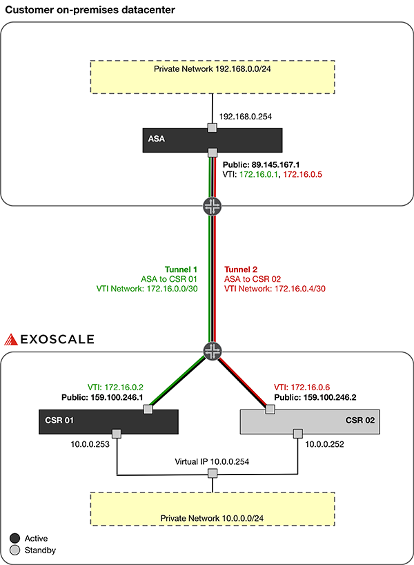

# VPN between Cisco CSR 1000V cluster and Cisco ASA

* [Requirements](#requirements)
* [Introduction](#introduction)
* [Configuration of CSR 01](#configuration-of-csr-01)
* [Configuration of CSR 02](#configuration-of-csr-02)
* [Check the CSR cluster status](#check-the-csr-cluster-status)
* [Configuration of ASA](#configuration-of-asa)
* [Check the IPSEC tunnel status](#check-the-ipsec-tunnel-status)
* [Additional Notice](#additional-notice)


## Requirements

* You have access to the [Exoscale Portal](https://portal.exoscale.com)
* You have access to your datacenter environment
* You have full control over firewall and security group rulesets to allow IPSEC traffic between the instances 
* You're familiar with Cisco in general and the CSR 1000V as well as the ASA in specific. If not, start with [Cisco CSR Configuration Guide](https://www.cisco.com/c/en/us/td/docs/routers/csr1000/software/configuration/b_CSR1000v_Configuration_Guide.html) and [Cisco ASA Configuration Guide](https://www.cisco.com/c/en/us/support/security/adaptive-security-appliance-asa-software/products-installation-and-configuration-guides-list.html), or contact [A1 Digital](mailto:vendors.security@a1.digital)
* You have valid licenses for all your instances
* You're familiar with Linux command line tools and scripting
* You already have some private networks defined on Exoscale you want to use

## Introduction

This deployment guide intents to describe how to achieve a CSR HA setup consisting of two CSR 1000V nodes and an ASA setup consisting of one ASA node. Instead of connecting directly through the internet, an IPSEC VPN tunnel is used to secure the connection. 

### Caution!

This is a lab setup to quickly demonstrate a customer use case, please adjust the architecture as well as the settings (especially IPSEC) to your needs! It is strongly recommended to use state-of-the-art encryption and key exchange mechanism like AES-256, IKEv2 and PFS.

### Use case

There are two main use cases, which use the same technology setup: 

* A client or server in the customers on-premises datacenters private network connects through the local ASA to the Exoscale platform using IPSEC VPN. 
* A client or server in the Exoscale zones private network connects through the CSR cluster to the on-premises datacenter using IPSEC VPN. 

Below you can see a network chart of such a deployment.



In the example architecture we use the following networks:

* Public network for management purpose.
* Private network ```192.168.0.0/24``` for clients or servers
* Private network ```10.0.0.0/24``` for clients or servers, as well as for cluster communication
* Private network ```172.16.0.0/30``` as Virtual Tunnel Interface (VTI) network for Tunnel 1
* Private network ```172.16.0.4/30``` as Virtual Tunnel Interface (VTI) network for Tunnel 2

The following instances and software versions have been used when writing this guide (all running on Exoscale):

* Cisco CSR 1000V 9.16.9.3
* Cisco ASAv 9.10

## Configuration of CSR 01
### 1. Configure management interface

```bash
router(config)# hostname csr1
csr1(config)# interface gigabitEthernet 1
csr1(config-if)# ip address dhcp
``` 

### 2. Enable SSH

```bash
csr1(config)# ip domain-name localhost.localdomain
csr1(config)# crypto key generate rsa
csr1(config)# enable secret cisco
csr1(config)# service password-encryption
csr1(config)# line vty 0 4
csr1(config-line)# transport input ssh
csr1(config-line)# login local
csr1(config-line)# password 0 cisco
csr1(config-line)# logging synchronous
csr1(config-line)# login local
```

### 3. Add user

```bash
csr1(config)# username cisco password cisco
csr1(config)# username cisco privilege 15
```

### 4. Configure the second interface and the cluster

```bash
csr1(config)#interface gigabitEthernet 2
csr1(config-if)#ip address 10.0.0.253 255.255.255.0
csr1(config-if)#standby 1 ip 10.0.0.254
csr1(config-if)#standby 1 priority 150
csr1(config-if)#standby 1 preempt delay minimum 5 reload 10
csr1(config-if)#standby use-bia
csr1(config-if)#no shut
```

### 5. Configure IPSEC VPN

```bash
csr1(config)# crypto keyring myvpn-keyring1
csr1(conf-keyring)#  local-address 159.100.246.1
csr1(conf-keyring)#  pre-shared-key address 89.145.167.1 key AopbQDlPWQ

csr1(config)# crypto isakmp policy 10
csr1(config-isakmp)# encr aes
csr1(config-isakmp)# authentication pre-share
csr1(config-isakmp)# group 2
csr1(config-isakmp)# lifetime 3600

csr1(config)# crypto isakmp profile myvpn-isakmp1
csr1(conf-isa-prof)#  keyring myvpn-keyring1
csr1(conf-isa-prof)#  match identity address 89.145.167.1 255.255.255.255
csr1(conf-isa-prof)#  local-address 159.100.246.1

csr1(config)# crypto ipsec transform-set mytransform-set1 esp-aes esp-sha-hmac
csr1(cfg-crypto-trans)# mode tunnel

csr1(config)# crypto ipsec profile myipsec-profile1
csr1(ipsec-profile)# set transform-set mytransform-set1
csr1(ipsec-profile)# set pfs group2
csr1(ipsec-profile)# set isakmp-profile myvpn-isakmp1
csr1(ipsec-profile)# responder-only

csr1(config)# interface Tunnel1
csr1(config-if)# ip address 172.16.0.2 255.255.255.252
csr1(config-if)# tunnel source 159.100.246.1
csr1(config-if)# tunnel mode ipsec ipv4
csr1(config-if)# tunnel destination 89.145.167.1 
csr1(config-if)# tunnel protection ipsec profile myipsec-profile1
csr1(config-if)# no shut

csr1(config)# ip route 192.168.0.0 255.255.255.0 172.16.0.1
```

## Configuration of CSR 02
### 1. Configure management interface

```bash
router(config)# hostname csr1
csr2(config)# interface gigabitEthernet 1
csr2(config-if)# ip address dhcp
``` 

### 2. Enable SSH

```bash
csr2(config)# ip domain-name localhost.localdomain
csr2(config)# crypto key generate rsa
csr2(config)# enable secret cisco
csr2(config)# service password-encryption
csr2(config)# line vty 0 4
csr2(config-line)# transport input ssh
csr2(config-line)# login local
csr2(config-line)# password 0 cisco
csr2(config-line)# logging synchronous
csr2(config-line)# login local
```

### 3. Add user

```bash
csr2(config)# username cisco password cisco
csr2(config)# username cisco privilege 15
```

### 4. Configure the second interface and the cluster

```bash
csr2(config)#interface gigabitEthernet 2
csr2(config-if)#ip address 10.0.0.252 255.255.255.0
csr2(config-if)#standby 1 ip 10.0.0.254
csr2(config-if)#standby 1 priority 150
csr2(config-if)#standby 1 preempt delay minimum 5 reload 10
csr2(config-if)#standby use-bia
csr2(config-if)#no shut
```

### 5. Configure IPSEC VPN

```bash
csr2(config)# crypto keyring myvpn-keyring2
csr2(conf-keyring)#  local-address 159.100.246.2
csr2(conf-keyring)#  pre-shared-key address 89.145.167.1 key AopbQDlPWQ

csr2(config)# crypto isakmp policy 10
csr2(config-isakmp)# encr aes
csr2(config-isakmp)# authentication pre-share
csr2(config-isakmp)# group 2
csr2(config-isakmp)# lifetime 3600

csr2(config)# crypto isakmp profile myvpn-isakmp2
csr2(conf-isa-prof)#  keyring myvpn-keyring2
csr2(conf-isa-prof)#  match identity address 89.145.167.1 255.255.255.255
csr2(conf-isa-prof)#  local-address 159.100.246.2

csr2(config)# crypto ipsec transform-set mytransform-set2 esp-aes esp-sha-hmac
csr2(cfg-crypto-trans)# mode tunnel

csr2(config)# crypto ipsec profile myipsec-profile2
csr2(ipsec-profile)# set transform-set mytransform-set2
csr2(ipsec-profile)# set pfs group2
csr2(ipsec-profile)# set isakmp-profile myvpn-isakmp2
csr2(ipsec-profile)# responder-only

csr2(config)# interface Tunnel2
csr2(config-if)# ip address 172.16.0.6 255.255.255.252
csr2(config-if)# tunnel source 159.100.246.2
csr2(config-if)# tunnel mode ipsec ipv4
csr2(config-if)# tunnel destination 89.145.167.1 
csr2(config-if)# tunnel protection ipsec profile myipsec-profile2
csr2(config-if)# no shut

csr2(config)# ip route 192.168.0.0 255.255.255.0 172.16.0.5
```


## Check the CSR cluster status

```bash
csr1#show standby
GigabitEthernet2 - Group 1
  State is Active
    1 state change, last state change 02:06:51
  Virtual IP address is 10.0.0.254
  Active virtual MAC address is 0af1.7c00.bd63 (MAC In Use)
    Local virtual MAC address is 0af1.7c00.bd63 (bia)
  Hello time 3 sec, hold time 10 sec
    Next hello sent in 0.416 secs
  Preemption enabled, delay min 5 secs, reload 10 secs
  Active router is local
  Standby router is 10.0.0.252, priority 10 (expires in 9.120 sec)
  Priority 150 (configured 150)
  Group name is "hsrp-Gi2-1" (default)
```

## Configuration of ASA

### 1. Configure the second interface

```bash
asa(config)# interface gigabitEthernet 0/0
asa(config-if)# ip address 192.168.0.254 255.255.255.0
asa(config-if)# nameif inside1
asa(config-if)# security-level 100
asa(config-if)# no shut
```

### 2. Configure IPSEC VPN

```bash
asa(config)# crypto ikev1 policy 10
asa(config-ikev1-policy)#  authentication pre-share
asa(config-ikev1-policy)# encryption aes
asa(config-ikev1-policy)# hash sha
asa(config-ikev1-policy)#  group 2
asa(config-ikev1-policy)#  lifetime 86400

asa(config)# crypto ipsec ikev1 transform-set mytransform-set1 esp-aes esp-sha-hmac
asa(config)# crypto ipsec profile myipsec-profile1
asa(config-ipsec-profile)# set pfs group2
asa(config-ipsec-profile)#   set security-association lifetime seconds 3600
asa(config-ipsec-profile)# set ikev1 transform-set mytransform-set1

asa(config)# crypto ipsec df-bit clear-df outside
asa(config)# sysopt connection tcpmss 1379
asa(config)# crypto ipsec security-association replay window-size 128
asa(config)# crypto ipsec fragmentation before-encryption outside
asa(config)# tunnel-group 159.100.246.1 type ipsec-l2l
asa(config)# tunnel-group 159.100.246.1 ipsec-attributes
asa(config-tunnel-ipsec)# ikev1 pre-shared-key AopbQDlPWQ
asa(config-tunnel-ipsec)# isakmp keepalive threshold 10 retry 10
asa(config-tunnel-ipsec)# interface tunnel 1
asa(config-if)# nameif tunnel1
asa(config-if)# ip address 172.16.0.1 255.255.255.252
asa(config-if)# tunnel source interface outside
asa(config-if)# tunnel destination 159.100.246.1 
asa(config-if)# tunnel mode ipsec ipv4
asa(config-if)# tunnel protection ipsec profile myipsec-profile1
asa(config-if)# no shut

asa(config)# crypto ipsec ikev1 transform-set mytransform-set2 esp-aes esp-sha-hmac
asa(config)# crypto ipsec profile myipsec-profile2
asa(config-ipsec-profile)# set pfs group2
asa(config-ipsec-profile)#   set security-association lifetime seconds 3600
asa(config-ipsec-profile)# set ikev1 transform-set mytransform-set2
asa(config)# tunnel-group 159.100.246.2 type ipsec-l2l
asa(config)# tunnel-group 159.100.246.2 ipsec-attributes
asa(config-tunnel-ipsec)# ikev1 pre-shared-key AopbQDlPWQ
asa(config-tunnel-ipsec)# isakmp keepalive threshold 10 retry 10
asa(config-tunnel-ipsec)# interface tunnel 2
asa(config-if)# nameif tunnel2
asa(config-if)# ip address 172.16.0.5 255.255.255.252
asa(config-if)# tunnel source interface outside
asa(config-if)# tunnel destination 159.100.246.2
asa(config-if)# tunnel mode ipsec ipv4
asa(config-if)# tunnel protection ipsec profile myipsec-profile2
asa(config-if)# no shut

asa(config)# sla monitor 123
asa(config-sla-monitor)# type echo protocol ipIcmpEcho 159.100.246.1 interface outside
asa(config-sla-monitor)# num-packets 3
asa(config-sla-monitor)# frequency 10
asa(config-sla-monitor-echo)# sla monitor schedule 123 life forever start-time now  
asa(config-sla-monitor-echo)#  track 1 rtr 123 reachability

asa(config)#route tunnel1 10.0.0.0 255.255.255.0 172.16.0.2 1 track 1
asa(config)#route tunnel2 10.0.0.0 255.255.255.0 172.16.0.6 254
```

## Check the IPSEC tunnel status

### CSR 01

```bash
csr1# show ip interface brief
Interface              IP-Address      OK? Method Status                Protocol
GigabitEthernet1       159.100.246.1   YES DHCP   up                    up      
GigabitEthernet2       10.0.0.253      YES manual up                    up      
Tunnel1                172.16.0.2      YES manual up                    up
```

### CSR 02

```bash
csr2# show ip interface brief
Interface              IP-Address      OK? Method Status                Protocol
GigabitEthernet1       159.100.246.2   YES DHCP   up                    up      
GigabitEthernet2       10.0.0.252      YES manual up                    up      
Tunnel2                172.16.0.6      YES manual up                    up
```

### ASA

```bash
asa# show interface ip brief 
Interface                  IP-Address      OK? Method Status                Protocol
GigabitEthernet0/0         192.168.0.254   YES manual up                    up  
Management0/0              89.145.167.1	   YES DHCP   up                    up  
Tunnel1                    172.16.0.1      YES manual up                    up  
Tunnel2                    172.16.0.5      YES manual up                    up 
```

## Additional Notice

Please check all script entries of their correctness. The IDs and names used here in the guide are also carefully checked for accuracy. If you have any questions or comments about this guide, please contact [A1 Digital](mailto:vendors.security@a1.digital).
