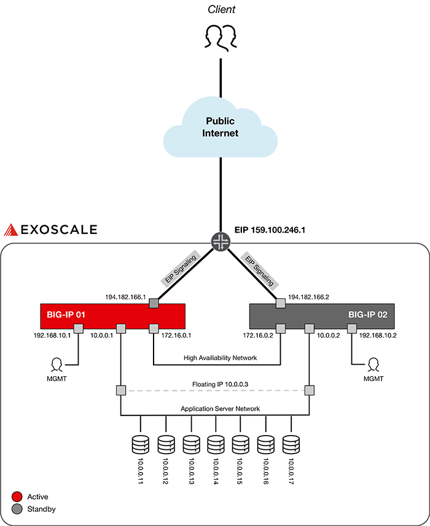

# Deploy an F5 BIG-IP Cluster on Exoscale

* [Requirements](#requirements)
* [Introduction](#introduction)
* [Deployment Guide](#deployment-guide)
	- [Prepare Exoscale environment](#1-prepare-exoscale-environment)
	- [Add two F5 BIG-IP instances](#2-add-two-f5-big-ip-instances)
	- [Prepare the two instances](#3-prepare-the-two-instances)
	- [Deploy the cluster](#4-deploy-the-cluster)
	- [Node, Pool, Virtual Server configuration](#5-node-pool-virtual-server-configuration)
* [Additional Notice](#additional-notice)

## Requirements

* You have access to the [Exoscale Portal](https://portal.exoscale.com)
* You're familiar with the Exoscale Portal and know how to deploy, edit and delete instances, Security Groups, Elastic IPs (EIP), etc. If not, start with [this guide](https://community.exoscale.com/documentation/compute/quick-start/) or contact [A1 Digital](mailto:vendors.security@a1.digital)
* You're familiar with F5. If not, start with [F5 Operations Guide](https://support.f5.com/csp/article/K73819494) or contact [A1 Digital](mailto:vendors.security@a1.digital)
* You have valid licenses for your F5 instances
* You're familiar with Linux command line tools and scripting
* You already have some application servers running on Exoscale, which are accessable via a private network and which you will use in this guide

## Introduction

In this tutorial, we will deploy an F5 BIG-IP Device Service Cluster (active-standby) consisting of two BIG-IP nodes. Since we want to utilize more than one public/private network in this setup, we will use the Multi-NIC deployment method. You can read more about this deployment method on [F5 Cloud Docs](https://clouddocs.f5.com/), e.g. Multi-NIC on [AWS](https://clouddocs.f5.com/cloud/public/v1/aws/AWS_multiNIC_shared.html) or [Azure](https://clouddocs.f5.com/cloud/public/v1/azure/Azure_multiNIC.html). 

The following figure shows an example architecture. Please note that example IP addresses are used, off course you will need to use your own subnet schemes and assigned Elastic IP. 



In the example architecture we use the following networks:

* Public network for client traffic coming from the Internet
* Private network ```192.168.10.0/24``` for instance management
* Private network ```172.16.0.0/24``` for cluster communication
* Private network ```10.0.0.0/24``` for application server connectivity

In the end, clients should access the Elastic IP which represents the service (e.g. a webshop). Traffic is then directed to the currently active BIG-IP, the load balancing decision is made and one of the available application servers answers the request. 

## Deployment Guide

In the next steps, we will deploy two F5 BIG-IP instances, configure them, build the Device Service Cluster and enable the Elastic IP signaling functionality to associate or dissociate BIG-IPs in the EIP settings. We will use Exoscale functionality like Elastic IP Adresses, Anti-Affinity Groups and Security Groups. 

### 1. Prepare Exoscale environment

We need to create / allocate the following ressources (if not already existing): 

* one API token to be used by exo-cli tool (have a look at [Exoscale IAM](https://community.exoscale.com/documentation/iam/quick-start/) functionality) to be able to associate and dissociate instances in the EIP settings
* one [Anti-Affinity group](https://community.exoscale.com/documentation/compute/anti-affinity-groups/) to make sure both instances run on different Exoscale hyperscalers
* one [Elastic IP Address (EIP)](https://community.exoscale.com/documentation/compute/eip/) for the client traffic
* three [Private Networks](https://community.exoscale.com/documentation/compute/private-networks/) for instance management, cluster communication and backend server connectivity
* some [Security Groups](https://community.exoscale.com/documentation/compute/security-groups/) to limit access to the instance public IP address (e.g. only allow HTTP and HTTPS from anywhere, but allow SSH from specific source IP addresses)

### 2. Add two F5 BIG-IP instances

We will start with the Single-NIC deployment where we only have one single NIC applied which serves client and administrative traffic. Following up we will configure the instances to   support multiple NICs. To do so, stick to the following procedure:

1. Add two F5 BIG-IP instances with the following settings:
	- use at least instance type "Medium"
	- no private network attached
	- Security Groups attached
	- Anti-Affinity Group attached
2. Make sure the instances are in the same public IP subnet! This is necessary since things like DNS or routes get synced in the cluster and therefore must apply to all nodes in the cluster. If your instances are in different subnets, try deleting them and recreating them until you have the same subnet. 

### 3. Prepare the two instances

For performance or hyperscaler/platform redundancy reasons, Exoscale instances use public IP addresses directly configured on the first network interface - unlike at AWS or Azure, no NAT/PAT-like functionality is between client traffic and the instances network interface. Therefore, in the process of getting from a Single-NIC to a Multi-NIC deployment, we must also change the management interface to use not the first interface (public network) but use the second interface (private network). Again, this is an example architecure, you can adapt this to your needs and use the fifth interface if you like. The only important thing is that the public network interface is used for client traffic, rather than management traffic. 

Use the following procedure to transform your instances from a Single-NIC to a Multi-NIC deployment. 

- Each instance must be configured separately, the commands below are exemplary for BIG-IP 01!
- Start with the base config and then move on with the network config. 

**Base config:**

1. Access the instance via the browser ```https://194.182.166.1:8443```
2. Change passwords and install the license
3. Set hostname, timezone, etc.
4. Create an [Archive](https://techdocs.f5.com/kb/en-us/products/big-ip_ltm/manuals/product/bigip-system-essentials-11-6-0/3.html) (better save than sorry)
5. Make sure that you have noted the public IP default gateway which is used by both instances. You will need it afterwards - in this case it is ```194.182.164.1```.
6. Make sure you have an easy-to-enter password for the deployment process since you will work a lot via the Exoscale console.

**Network config:**

7. Add your first private network via the Exoscale Portal, which will be used as the management network. Add only this network, no more!
8. Reboot the instance, which is now internally recognising the second interface and automatically changes the config from Single-NIC to Multi-NIC
9. Execute ```tmsh modify sys db provision.managementeth value eth1``` to change the management interface from eth0 (default) to eth1
10. Reboot the instance to make sure everything is applied correctly
11. Execute the following commands via the Exoscale console:
	- disable Mgmt-DHCP: 
		```tmsh modify sys global-settings mgmt-dhcp disabled```
	- set a new Mgmt IP: 
		```tmsh create sys management-ip 192.168.10.1/24```
	- change Mgmt WebGUI port:
		```tmsh modify sys httpd ssl-port 443```
12. Interface 1.0 (the first interface, formerly the Mgmt interface using the Single-NIC deployment) can now be configured for VLAN / Self-IP using the public IP address. Additional Elastic IPs assigned to the instance via the Exoscale Portal are assigned to that interface 1.0. Execute the following commands:
	- delete the existing VLAN "internal": 
		```tmsh delete net vlan internal```
	- create a new VLAN "public-internet" with untagged interface 1.0:
		```tmsh create net vlan public-internet interfaces add { 1.0 { untagged } }```
	- create a new public IP Self-IP:
		```tmsh create net self self-public address 194.182.166.1/22 vlan public-internet allow-service none```
	- Optional: to enable TCP port 22 and 443 on this Self-IP (useful if you want to manage the instance via the public Self-IP), execute:
		```tmsh modify net self self-public allow-service replace-all-with { tcp:22 tcp:443 }```
	- create a new default route for Internet traffic:
		```tmsh create net route Default_GW network 0.0.0.0/0 gw 194.182.164.1```
13. Create additional VLANs and Self-IPs, each for every private network and according to your interface assignment:
	- ```tmsh create net vlan high-availability interfaces add { 1.2 { untagged } }```
	- ```tmsh create net vlan application-server interfaces add { 1.3 { untagged } }```
	- ```tmsh create net self self-high-availability address 172.16.0.1/24 vlan high-availability allow-service default```
	- ```tmsh create net self self-application-server address 10.0.0.1/24 vlan application-server allow-service none```
14. Save the config: ```tmsh save sys config```

### 4. Deploy the cluster

We will now configure the active-standby cluster as well as the Elastic IP signaling script. The script is used to change the Elastic IP upon failover so that always the active BIG-IP serves client traffic via the Elastic IP. Start with configuring BIG-IP 02 and then move on with BIG-IP 01. 

**Configure the following only on BIG-IP 02**, change the variables to your needs:

1. Add the config-sync IP: 
	```tmsh modify cm device $BIG-IP02_HOSTNAME configsync-ip 172.16.0.1```
2. Add the failover network IP:
	```modify cm device $BIG-IP02_HOSTNAME unicast-address { { ip 172.16.0.1 } { ip management-ip }}``` 
3. Add the session mirroring IP:
	```tmsh modify cm device $BIG-IP02_HOSTNAME mirror-ip 172.16.0.1```

**Configure the following only on BIG-IP 01**, change the variables to your needs:

1. Add a floating Self-IP to the application server network: 
	```tmsh create net self self-application-server address 10.0.0.3/24 vlan application-server allow-service none traffic-group traffic-group-1```
2. Add the config-sync IP:
	```tmsh modify cm device $BIG-IP01_HOSTNAME configsync-ip 172.16.0.1```
3. Add the failover network IP: 
	```modify cm device $BIG-IP01_HOSTNAME unicast-address { { ip 172.16.0.1 } { ip management-ip }}``` 
4. Add the session mirroring IP: 
	```tmsh modify cm device $BIG-IP01_HOSTNAME mirror-ip 172.16.0.1```
5. Add BIG-IP 02 to the device trust: 
	```tmsh modify cm trust-domain add-device { device-name $BIG-IP02_HOSTNAME device-ip 172.16.0.2 username admin password $PASSWORD }```
6. Create a new sync group: 
	```tmsh create cm device-group f5-cluster devices add { $BIG-IP01_HOSTNAME $BIG-IP02_HOSTNAME } type sync-failover network-failover enabled```
7. Sync the config from BIG-IP 01 to BIG-IP 02 and confirm the sync: 
	```run cm config-sync force-full-load-push to-group f5-cluster```

**Enable the signaling script on each instance separately**, the commands below are exemplary for BIG-IP 01!

1. Download [exo-cli tool](https://github.com/exoscale/cli/releases), place it to the directory **/config/failover/exo** (you'll have to create the ```exo``` directory since it doesn't exist) and make it executable (```chmod +x exo```)
2. Initialize the exo-cli tool (using ```./exo config```) and enter your API token
3. Append the following to the file **/config/failover/active**, which will be run when the instance is getting active. You find the instance ID in the Exoscale 
	Portal. 
	
	```bash
	ELASTIC_IP="159.100.246.1"
	INSTANCE_ID_SELF="a123a12a-12bb-1c1c-1dd1-12345e12ee12"
	NOW="$(date '+%Y-%m-%d %H:%M:%S')"
	
	echo $NOW": associating instance '"$INSTANCE_ID_SELF"' to EIP '"$ELASTIC_IP"'" >> /var/log/eip.log
	/config/failover/exo/exo eip associate -Q $ELASTIC_IP $INSTANCE_ID_SELF
	```
4. Append the following to the file **/config/failover/standby**, which will be run when the instance is getting 
	standby. 
	
	```bash
	ELASTIC_IP="159.100.246.1"
	INSTANCE_ID_SELF="a123a12a-12bb-1c1c-1dd1-12345e12ee12"
	NOW="$(date '+%Y-%m-%d %H:%M:%S')"
	
	echo $NOW": dissociating instance '"$INSTANCE_ID_SELF"' from EIP '"$ELASTIC_IP"'" >> /var/log/eip.log
	/config/failover/exo/exo eip dissociate -Q -f $ELASTIC_IP $INSTANCE_ID_SELF
	```
5. Edit the file 
	**/config/user_alert.conf**
	
	```bash 
	alert going_active "Active for traffic group traffic-group-1" {
	exec command="/config/failover/active"
	}
	 
	alert going_standby "Standby for traffic group traffic-group-1" {
	exec command="/config/failover/standby"
	}
	```

When a failover from one to another BIG-IP occurs, the syslog listener (file ```/config/user_alert.conf```) recognises the failover via the LTM log file (```/var/log/ltm```) and executes the corresponding bash script, which associates or dissociates the BIG-IP in the EIP settings.

### 5. Node, Pool, Virtual Server configuration

Now it's time to start with the module-specific configuration, e.g. create nodes, pools, virtual servers, etc. Always keep in mind that you're using a cluster, so don't forget syncing (in the right direction :wink:).  

## Additional Notice

Please check all script entries of their correctness. The IDs and names used here in the guide are also carefully checked for accuracy. If you have any questions or comments about this guide, please contact [A1 Digital](mailto:vendors.security@a1.digital).