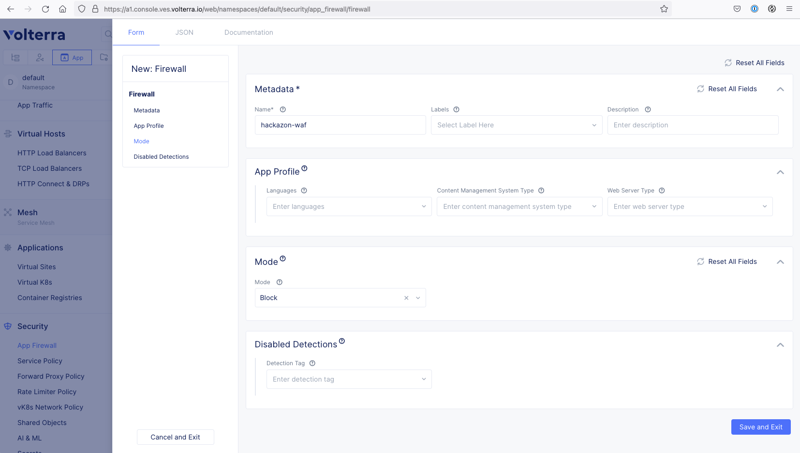
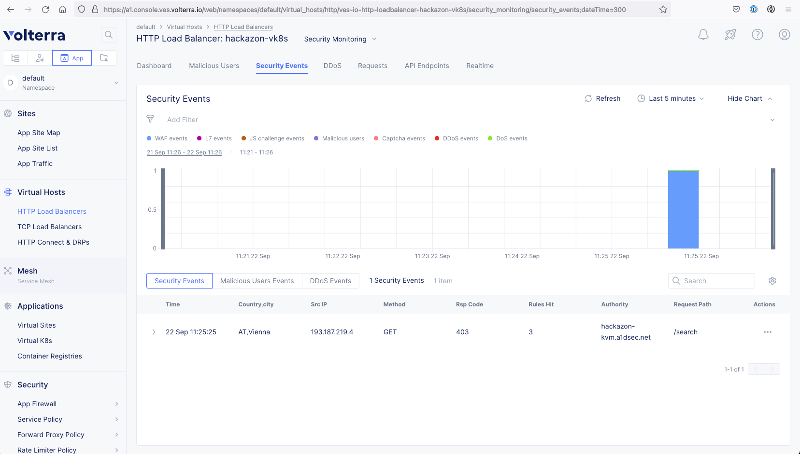
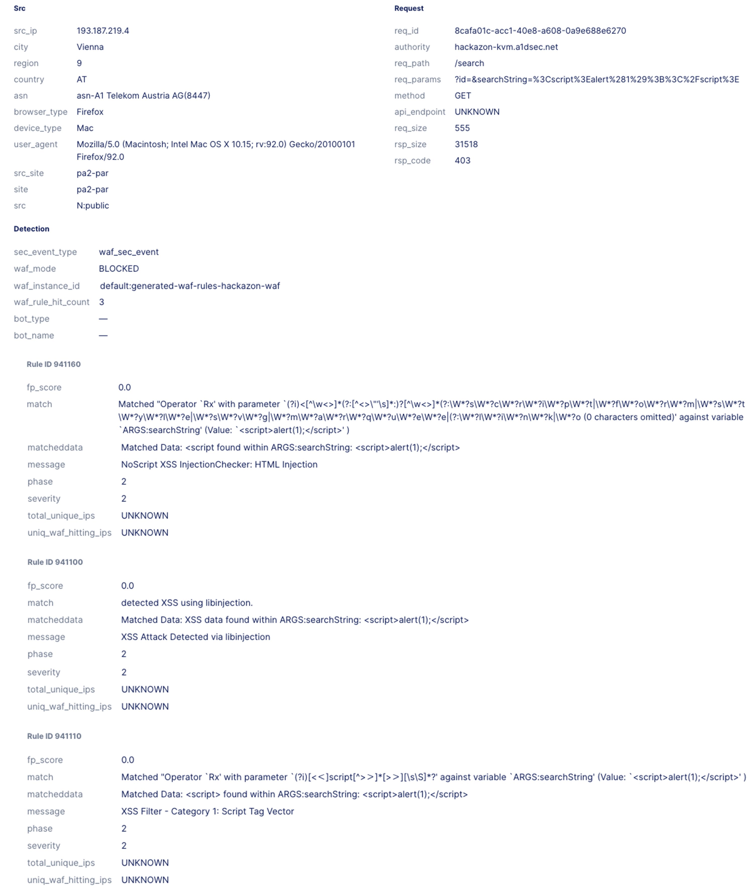

# Deploy a cloud-managed WAF with local TLS termination

* [Requirements](#requirements)
* [Introduction](#introduction)
* [Deployment Guide](#deployment-guide)
	- [Define WAF ruleset](#1-define-waf-ruleset)
	- [Apply WAF ruleset and test it](#2-apply-waf-ruleset-and-test-it)
* [Additional Notice](#additional-notice)

## Requirements

* You have access to the [Exoscale Portal](https://portal.exoscale.com)
* You're familiar with the Exoscale Portal and know how to deploy, edit and delete instances, Security Groups, Elastic IPs (EIP), etc. If not, start with [this guide](https://community.exoscale.com/documentation/compute/quick-start/) or contact [A1 Digital](mailto:vendors.security@a1.digital)
* You're familiar with Volterra. If not, start with the [Volterra documentation](https://www.volterra.io/docs) or contact [A1 Digital](mailto:vendors.security@a1.digital)
* You have a valid Volterra subscription plan - either free or paid
* You're familiar with Linux and Kubernetes command line tools

## Introduction

In this tutorial, we will deploy the Volterra application security stack (web application firewall functionality) which can be used to protect applications residing in any possible Volterra environment. Pre-requirement for this setup is an already deployed Volterra stack (please see [this article](volterra-site-kvm.md)). 

In our example architecture, we have already deployed two Volterra sites, one consisting of three nodes in Exoscale zone Frankfurt and one with three nodes in zone Zurich. These two sites are part of a virtual Kubernetes deployment, which hosts the [Hackazon](https://github.com/rapid7/hackazon) example application. 

The Volterra administrative portal ```VoltConsole``` can be accessed here: 


Our architecture looks like the following:


## Deployment Guide

### 1. Define WAF ruleset

To enable the WAF functionality on one ore more applications (most likely HTTP Load Balancers in Volterra terms), we have to create an App Firewall entity. To do so, navigate to ```App -> Security -> App Firewall -> App Firewalls``` and add a firewall. For our demonstration, we will use the blocking mode to not only alert when violations occure, but also block them directly. 



Navigating to ```App -> Security -> App Firewall -> App Firewall Rules```, we see a new firewall ruleset was created. Off course, we can edit the ruleset to change the WAF mode (alert or block), change detection sensity or include/exclude specific attack types/rule IDs. 

### 2. Apply WAF ruleset and test it

To apply the previously generated WAF ruleset, edit the HTTP Load Balancer object. Since the load balancer type is still ```HTTP``` and we want to demonstrate TLS termination, we need to change that to ```HTTPS```. Depending on your setup, you can use ```HTTPS with Automatic Certificate``` if you delegated your domain to Volterra (like we did). If that's not the case, you need to use ```HTTPS with Custom Certificate``` and upload your own TLS certificate. 


After that, head to the ```Security Configuration``` section. There you need to enable ```Show Advanced Fields``` on the right and set the WAF ruleset.


After saving the config and waiting for the TLS certificate validation (column ```TLS info```), we can test the WAF ruleset by executing a [Cross-Site-Scripting (XSS)](https://en.wikipedia.org/wiki/Cross-site_scripting) attack. To do so, browse the following URL:

```
https://hackazon-kvm.a1dsec.net/search?id=&searchString=%3Cscript%3Ealert(1)%3B%3C%2Fscript%3E
```

As you see, the attack has been blocked. 


Now navigating to ```App -> Virtual Hosts -> HTTP Load Balancers```, click on ```Security Events``` of the ```hackazon-vk8s``` object. You see now all security-related events and information. On the bottom, there is the corresponding blocking event listed.



Opening the blocking event menu, you see a lot of details about the event itself and the reason why the request has been blocked. 



**That's it!** We now have secured a globally distributed application with just a few clicks, have full insights about the traffic flow, attack vectors and issues of the application and most important: have taken care of data security by terminating TLS not in the cloud, but in the local GDPR-compliant, European datacenter. 


## Additional Notice

Please check all script entries of their correctness. The IDs and names used here in the guide are also carefully checked for accuracy. If you have any questions or comments about this guide, please contact [A1 Digital](mailto:vendors.security@a1.digital).