# Volterra application deployment across multiple Exoscale zones

* [Requirements](#requirements)
* [Introduction](#introduction)
* [Deployment Guide](#deployment-guide)
	- [Deploy Volterra nodes in each zone on Exoscale](#1-deploy-volterra-nodes-in-each-zone-on-exoscale)
	- [Site and node deployment](#2-site-and-node-deployment)
	- [Virtual Site deployment](#3-virtual-site-deployment)
	- [Virtual Kubernetes deployment](#4-virtual-kubernetes-deployment)
	- [Deploy the Hackazon app](#5-deploy-the-hackazon-app)
	- [Create a load balancer to publish the app to the Internet](#6-create-a-load-balancer-to-publish-the-app-to-the-internet)
	- [So, what’s next?](so-what's-next)
* [Additional Notice](#additional-notice)

## Requirements

* You have access to the [Exoscale Portal](https://portal.exoscale.com)
* You're familiar with the Exoscale Portal and know how to deploy, edit and delete instances, Security Groups, Elastic IPs (EIP), etc. If not, start with [this guide](https://community.exoscale.com/documentation/compute/quick-start/) or contact [A1 Digital](mailto:vendors.security@a1.digital)
* You're familiar with Volterra. If not, start with the [Volterra documentation](https://www.volterra.io/docs) or contact [A1 Digital](mailto:vendors.security@a1.digital)
* You have a valid Volterra subscription plan - either free or paid
* You're familiar with Linux and Kubernetes command line tools

## Introduction

In this tutorial, we will deploy multiple Volterra sites on various Exoscale zones to support a globally available, redundant, and secure application setup. 

In contrast to our [first tutorial](volterra-site-sks.md) where an Exoscale SKS managed Kubernetes cluster was used, we will use this time plain KVM virtual machines (```Volterra nodes```) to demonstrate global availability and load balancing across multiple Exoscale zones utilizing the Volterra virtual Kubernetes functionality.

The corresponding Volterra products to be used are:

* [VoltMesh](https://www.volterra.io/docs/about-volt/volt-mesh)
* [VoltStack](https://www.volterra.io/docs/about-volt/volt-stack)

We will use VoltStack as an application deployment stack based on Kubernetes and VoltMesh as a logical layer offering application delivery and security over a single pane of glass. 

The Volterra administrative portal ```VoltConsole``` can be accessed here: 

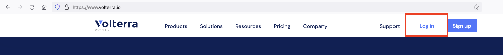

Our architecture looks like the following:

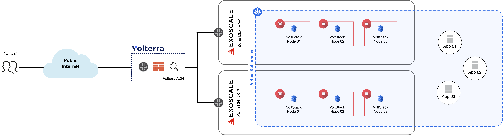

## Deployment Guide

### 1. Deploy Volterra nodes in each zone on Exoscale

As a first step, we need to deploy three virtual machines in each the Exoscale zone DE-FRA-1 (Frankfurt) and CH-DK-2 (Zurich). Since this is still a lab environment and far away from productive, we don’t care about private networks or anti-affinity groups. Anyway, we will not use a single-node deployment, but the three nodes per site will act as Kubernetes master nodes providing high-availability. In an productive setup, we would deploy additional Kubernetes worker nodes beside these master nodes. 

At the time of this writing, the official Volterra KVM image is not yet released to public, but you will get the corresponding QCOW2 file from the Volterra SE you trust. In our case, we have deployed the QCOW2 file with the version tag ```volterra-centos-7.2009.5-202103011045``` as a custom template in the corresponding zones. 

We will use the following naming convention:

* Site ```kvm-de``` with nodes
	- ```kvm-de-node1```
	- ```kvm-de-node2```
	- ```kvm-de-node3```
* Site ```kvm-ch``` with nodes
	- ```kvm-ch-node1```
	- ```kvm-ch-node2```
	- ```kvm-ch-node3```

To deploy the nodes, you can use the following exo-cli command snipped. Please adjust them to your needs. 

Make sure that if you use a custom security group, egress traffic is allowed. You don’t need any particular ingress rule, which means the node itself is not accessible through the Internet. The only ingress rule you need is to allow all TCP, UDP and ICMP traffic from one node to another, which can be seen as node-internal traffic.

```
exo compute security-group create volterra-sg
exo compute security-group add volterra-sg -p tcp -P 1-65535 -s volterra-sg
exo compute security-group add volterra-sg -p udp -P 1-65535 -s volterra-sg
exo compute security-group add volterra-sg -p icmp --icmp-type 8 --icmp-code 0 -s volterra-sg
exo compute security-group add volterra-sg -p icmp --icmp-type 0 --icmp-code 0 -s volterra-sg

exo compute instance create "kvm-de-node1" \
  --instance-type "Large" \
  --disk-size "100" \
  --security-group "volterra-sg" \
  --template "volterra-node" \
  --template-visibility "private" \
  --zone "de-fra-1"

exo compute instance create "kvm-de-node2" \
  --instance-type "Large" \
  --disk-size "100" \
  --security-group "volterra-sg" \
  --template "volterra-node" \
  --template-visibility "private" \
  --zone "de-fra-1"

exo compute instance create "kvm-de-node3" \
  --instance-type "Large" \
  --disk-size "100" \
  --security-group "volterra-sg" \
  --template "volterra-node" \
  --template-visibility "private" \
  --zone "de-fra-1"
```

We now should have 6 virtual machines up and running. 

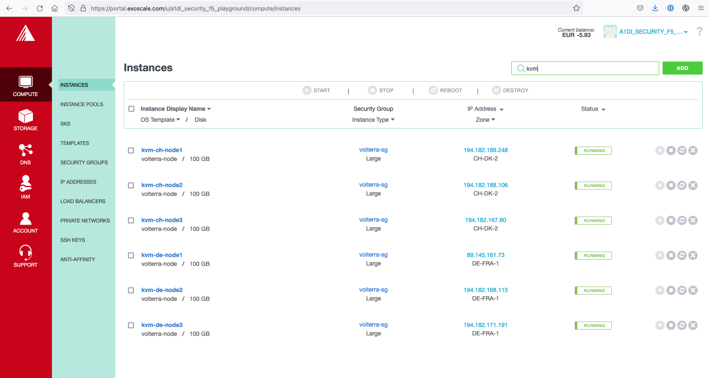

### 2. Site and node deployment

First, we need to create the two VoltStack Site manually. This is done navigating to ```System -> Manage -> Site Management -> DC or Edge Sites -> VoltStack Sites -> Add VoltStack Site```. Make sure you select ```kvm-voltstack-combo``` as Generic Server Certified Hardware and enter all three corresponding node names as Master Nodes.

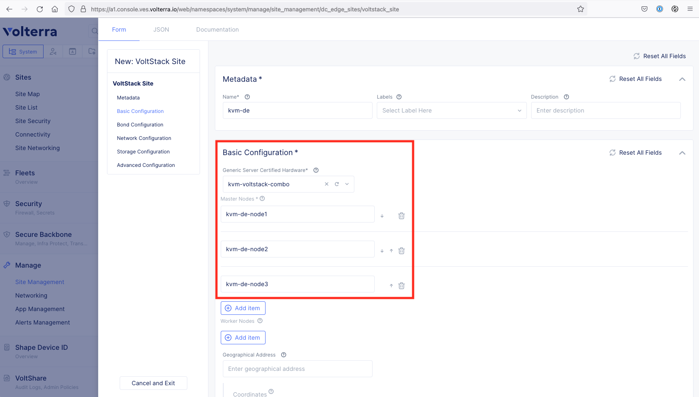

Every node needs to be registered and approved using a site-specific token. Tokens can be site-specific or can be used across various sites. If you have not yet created a site token, create one called ```exoscale-sites``` and use it for the deployment of all Exoscale sites.

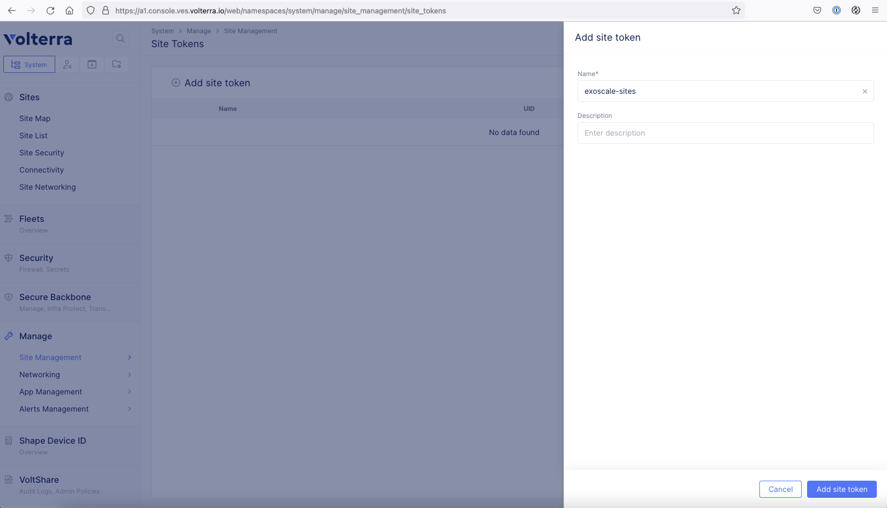

Now we need to use the Exoscale console via the Web Portal or – if you have enabled SSH access via the security group – SSH to access and configure each node. The default credentials are:

* Username: ```admin```
* Password: ```Volterra123```

**Please make sure to change them at the initial login!**

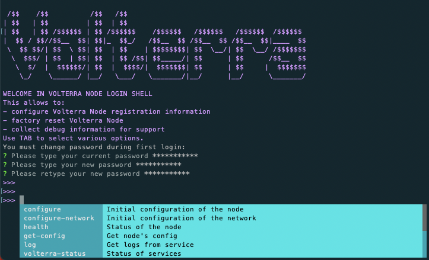

Execute ```configure``` to start node configuration. We will start with node ```kvm-de-node1```. Off course, you must do the configuration on all 3 nodes in every site and change the site token to your own one! 

* What is your token? ```2d5c41bf-9b1e-4054-9d68-aab04cf8b922```
* What is your site name? ```kvm-de```
* What is your hostname? ```kvm-de-node1```
* What is your latitude? ```50.096802```
* What is your longitude? ```8.644070```
* What is your default fleet name? **<< enter >>**
* Select certified hardware: ```kvm-voltmesh```
* Select primary outside NIC: ```eth0```
* Confirm configuration: ```y```

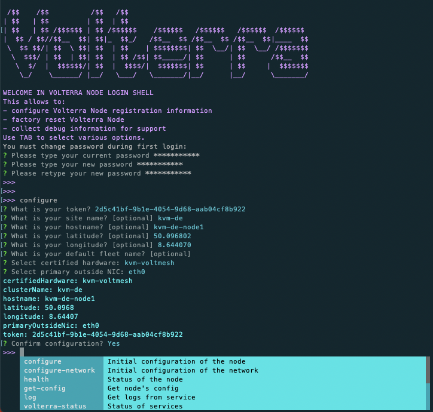

Navigate to ```System -> Manage -> Site Management -> Registrations```. In the end, you should have listed four nodes with pending site registration.

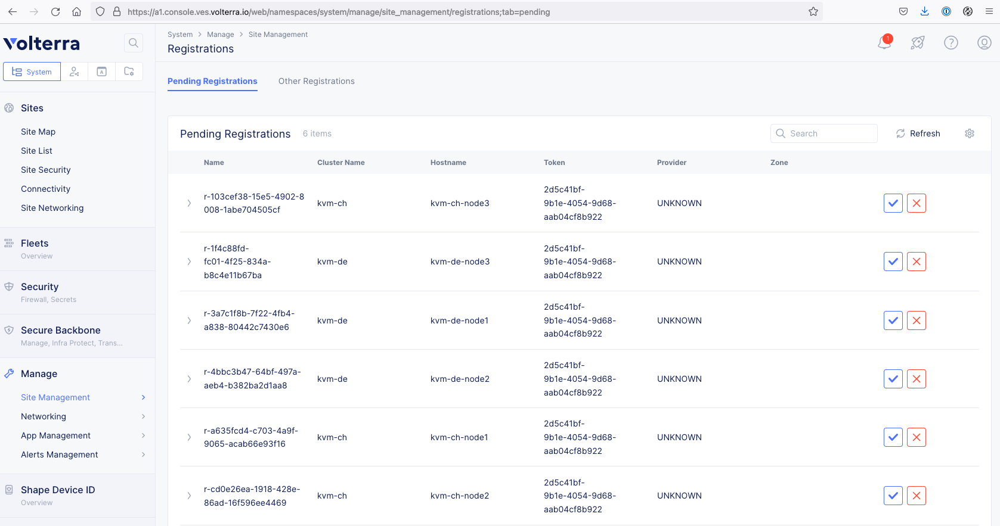

Approve each of them and make sure that you use the following settings:

* Cluster Size: ```3```
* Site to Site Tunnel Type: ```IPSEC or SSL```

After some time, the new sites will be marked healthy in the Site Connectivity page (```System -> Sites -> Site List```). Please note that this can take up to 30 minutes due to internal consistency and connectivity checks. 

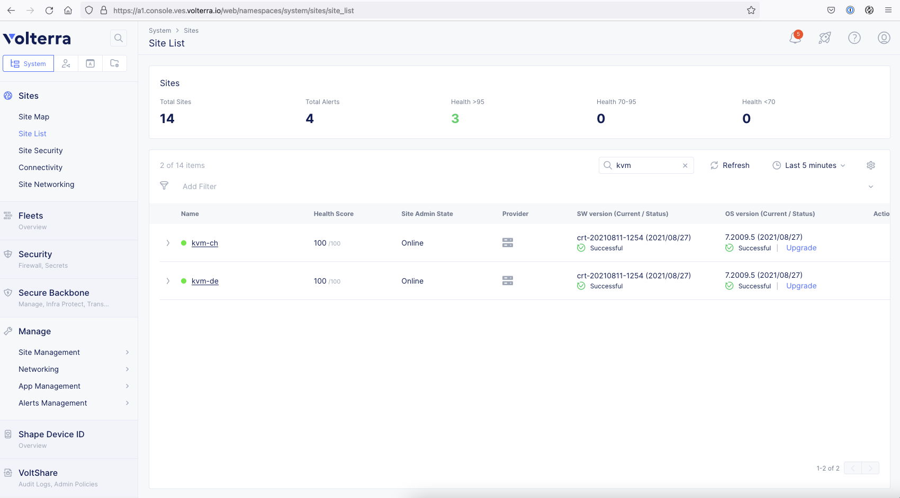

It’s useful to label specific sites or parts of that site so that you can later on reference on these dynamic labels rather than on static site or node names. In our example, we will use the key ```exo-type``` and the value ```kvm```. To do so, navigate to ```System -> Manage -> Site Management -> DC or Edge Sites -> VoltStack Sites```. On the right of every site, click the three dots, select ```Edit``` and add the label. 

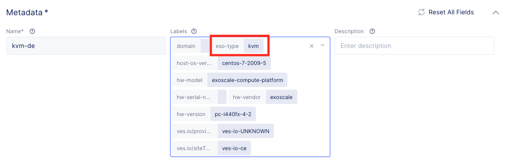

### 3. Virtual Site deployment

With these two sites with each three nodes, we can now form a so-called ```Virtual Site```. This enables us to see our deployment from a global perspective, where nodes (virtual machines) and even datacenters/regions can be added or deleted without changing the overall application delivery logic. 

To do so, navigate to ```App -> Manage -> Virtual Sites``` and add a new Virtual Site called ```kvm-sites```. Make sure to select the type ```CE``` (= Customer Edge) and set the selector expression ```exo-type == kvm```. 

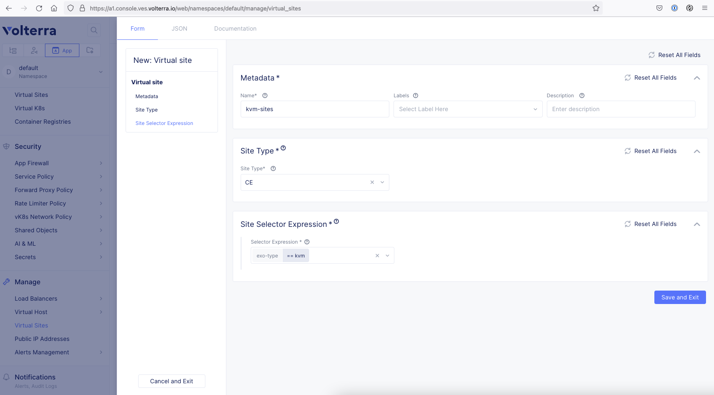

### 4. Virtual Kubernetes deployment

Next step is to span a virtual Kubernetes cluster above this virtual site. This enables us (and therefore, developers) to use a single Kubernetes kubeconfig file and API for application deployment, without needing to worry about application deployment and distribution across geologically separated zones or environments. 

Navigate to ```App -> Applications -> Virtual K8s```, add a new virtual Kubernetes called ```vk8s``` and select our Virtual Site ```kvm-sites```. 

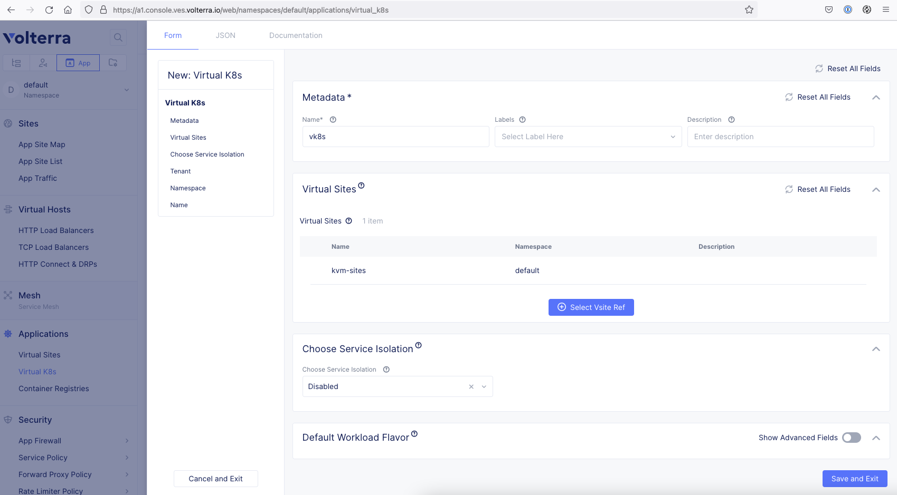

After deployment, you can download your kubeconfig file by clicking on the three dots at the right side. 

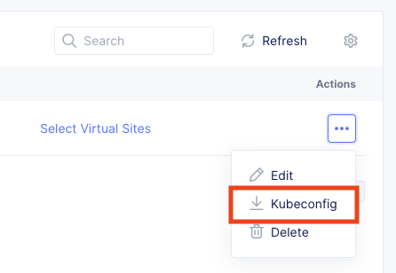

### 5. Deploy the Hackazon app

We can use the following manifest to add the Hackazon web application:

```
apiVersion: v1
kind: Service
metadata:
  name: hackazon
  labels:
    app: hackazon
    service: hackazon
spec:
  ports:
  - port: 80
    name: hackazon-80
    protocol: TCP
    name: http
  selector:
    app: hackazon
---
apiVersion: apps/v1
kind: Deployment
metadata:
  name: hackazon
  labels:
    app: hackazon
    version: v1
spec:
  replicas: 3
  selector:
    matchLabels:
      app: hackazon
      version: v1
  template:
    metadata:
      labels:
        app: hackazon
        version: v1
    spec:
      containers:
      - env:
        - name: service_name
          value: hackazon
        image: santosomar/hackazon:latest
        imagePullPolicy: IfNotPresent
        name: hackazon
        ports:
        - containerPort: 80
          protocol: TCP
```

We now see in the Virtual K8s dashboard that 6 pods have been deployed, even if the manifest only states 3 replicas. This is the already enabled replication functionality inside the virtual Kubernetes cluster. 

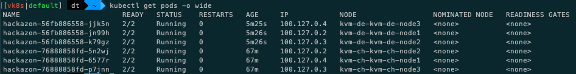

### 6. Create a load balancer to publish the app to the Internet

To publish the Hackazon app to the Internet, we need a load balancer object. We always have the choice between a pure TCP-based and a more-enhanced HTTP-based load balancer. In our case, we will configure a HTTP load balancer which uses the Hackazon app as a so-called ```Origin Pool``` – which is the desired backend the load balancer uses for frontend requests. This Origin Pool will also have a HTTP health check assigned to make sure the 

To add a new health check, navigate to ```App -> Manage -> Load Balancers -> Health Checks``` and add a new HTTP health check with the name ```plain-http```. 

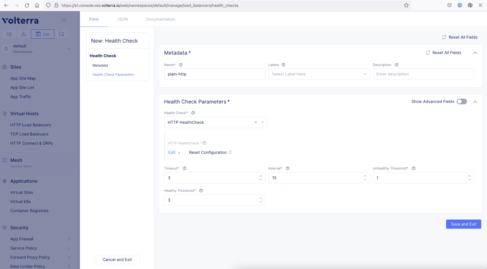

To add a new Origin Pool, navigate to ```App -> Manage -> Load Balancers -> Origin Pools``` and add a new Origin Pool. Use the following settings:

* Name: ```hackazon-vk8s```
* Type: ```K8s Service Name of Origin Server on give Sites```
* Service Name: ```hackazon.default```
* Virtual Site: ```default/kvm-sites```
* Port: ```80```
* Health Check: ```plain-http```

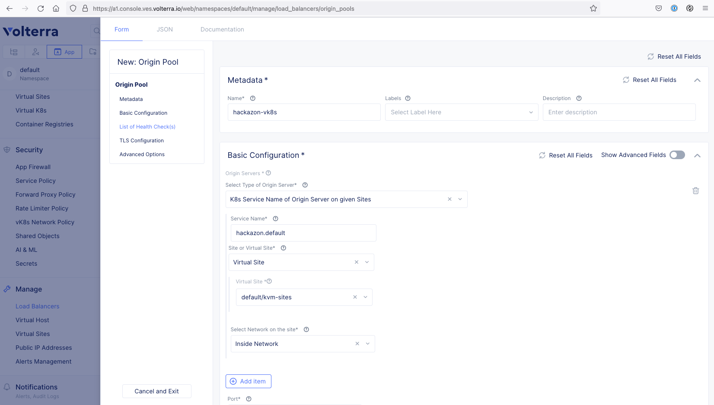

Next, we need a HTTP load balancer. Navigate to ```App -> Manage -> Load Balancers -> HTTP Load Balancers``` and add a load balancer. We can use the following settings:

* Name: ```hackazon-vk8s```
* Domains: ```hackazon-kvm.a1dsec.net```
* Type: ```HTTP```
* Origin Pool: ```default/hackazon-vk8s```

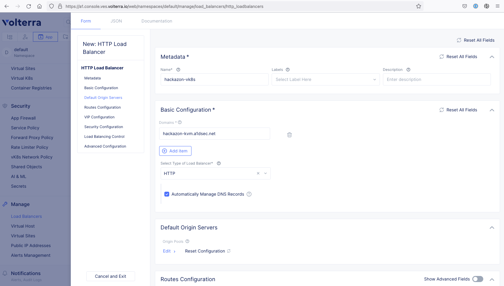

Please note, that in our case we’re using a domain which is fully managed by Volterra. If you use a custom domain outside of Volterra, you will have to update your DNS manually after load balancer deployment.

We can now access the application in the browser:

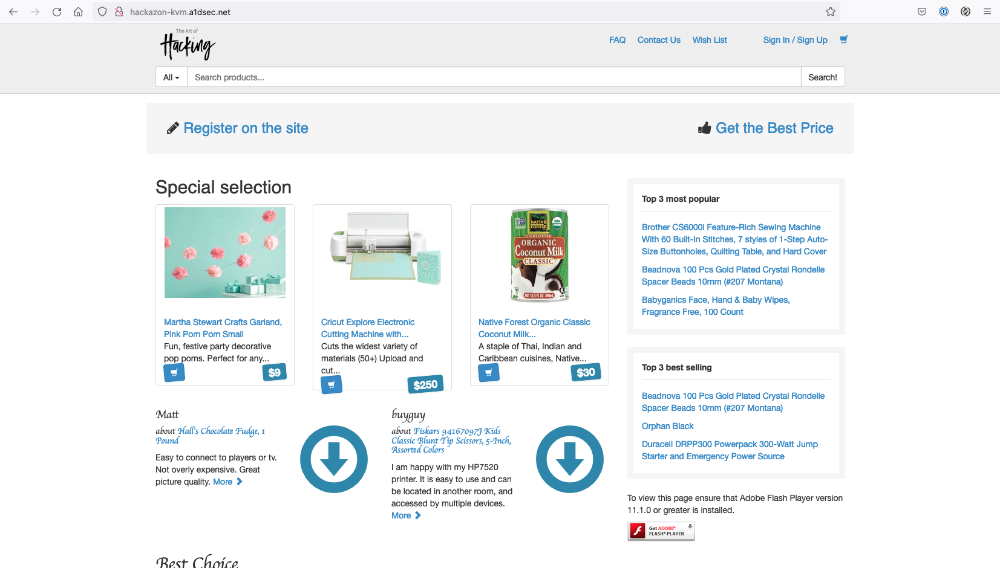

### So, what’s next?

You can now think about:

* Intelligent traffic distribution using traffic routes and circuit breaker
* Application security to secure your apps without changing a single piece of software code


## Additional Notice

Please check all script entries of their correctness. The IDs and names used here in the guide are also carefully checked for accuracy. If you have any questions or comments about this guide, please contact [A1 Digital](mailto:vendors.security@a1.digital).