# Deploy a Volterra site inside an Exoscale SKS cluster

* [Requirements](#requirements)
* [Introduction](#introduction)
* [Deployment Guide](#deployment-guide)
	- [Deploy a SKS cluster](#1-deploy-a-sks-cluster)
	- [Prepare Kubernetes cluster configuration](#2-prepare-kubernetes-cluster-configuration)
	- [Register the Kubernetes cluster](#3-register-the-kubernetes-cluster)
	- [Enable service discovery](#4-enable-service-discovery)
	- [Deploy the Hackazon app](#5-deploy-the-hackazon-app)
	- [Create a load balancer to publish the app to the Internet](#6-create-a-load-balancer-to-publish-the-app-to-the-internet)
	- [So, what’s next?](so-what's-next)
* [Additional Notice](#additional-notice)

## Requirements

* You have access to the [Exoscale Portal](https://portal.exoscale.com)
* You're familiar with the Exoscale Portal and know how to deploy, edit and delete instances, Security Groups, Elastic IPs (EIP), etc. If not, start with [this guide](https://community.exoscale.com/documentation/compute/quick-start/) or contact [A1 Digital](mailto:vendors.security@a1.digital)
* You're familiar with Volterra. If not, start with the [Volterra documentation](https://www.volterra.io/docs) or contact [A1 Digital](mailto:vendors.security@a1.digital)
* You have a valid Volterra subscription plan - either free or paid
* You're familiar with Linux and Kubernetes command line tools

## Introduction

In this tutorial, we will deploy a Volterra site inside an [Exoscale SKS](https://www.exoscale.com/sks/) managed Kubernetes cluster to

* demonstrate the integration into existing Kubernetes cluster on Exoscale
* demonstrate the discovery of services of the Kubernetes cluster to be used inside the Volterra console
* demonstrate the Volterra gateway functionality to reach internal, non-exposed Kubernetes services

The corresponding Volterra products to be used are:

* [VoltMesh](https://www.volterra.io/docs/about-volt/volt-mesh)
* [VoltStack](https://www.volterra.io/docs/about-volt/volt-stack)

We will use VoltMesh functionality to route traffic to specific Kubernetes services or to resources outside of the Kubernetes cluster (e.g. using private networks attached to the Kubernetes nodes). 

The Volterra administrative portal ```VoltConsole``` can be accessed here: 


Our architecture looks like the following:

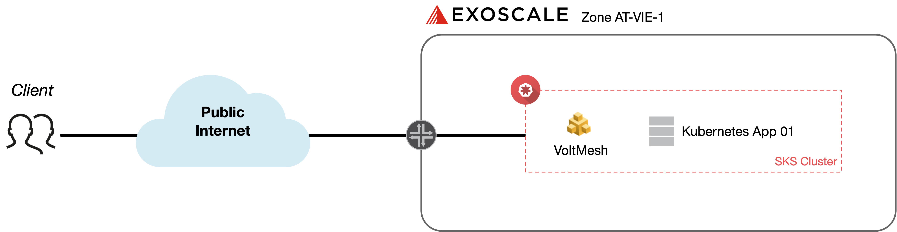


## Deployment Guide 

### 1. Deploy a SKS cluster

To deploy a SKS Managed Kubernetes cluster, we will use the [exo-cli](https://community.exoscale.com/documentation/tools/exoscale-command-line-interface/) tool – but this can off course also be done via the Exoscale web portal. The cluster will be called ```sks-vie``` with corresponding node pool consisting of three Kubernetes nodes. Use the following commands to create the cluster:

```
exo compute security-group create sks-vie
exo compute security-group add sks-vie -d "NodePort services" -p tcp -P 30000-32767
exo compute security-group add sks-vie -d "SKS Logs" -p tcp -P 10250
exo compute security-group add sks-vie -d "Calico traffic" -p udp -P 4789 -s sks-vie

exo sks create sks-vie --description "sks-vie" \
  --nodepool-name "sks-vie-pool" \
  --nodepool-size 3 \
  --nodepool-disk-size 400 \
  --nodepool-instance-type large \
  --nodepool-security-group "sks-vie" \
  --zone at-vie-1 \
  --service-level pro
```

We now have a running SKS cluster:

```
┼───────────────┼──────────────────────────────────────────────────────────────────┼
│  SKS CLUSTER  │                                                                  │
┼───────────────┼──────────────────────────────────────────────────────────────────┼
│ ID            │ ae368d43-026e-4afe-b669-e9b9fca92591                             │
│ Name          │ sks-vie                                                          │
│ Description   │ sks-vie                                                          │
│ Zone          │ at-vie-1                                                         │
│ Creation Date │ 2021-08-26 09:23:37 +0000 UTC                                    │
│ Endpoint      │ https://ae368d43-026e-4afe-b669-e9b9fca92591.sks-at-vie-1.exo.io │
│ Version       │ 1.21.3                                                           │
│ Service Level │ pro                                                              │
│ CNI           │ calico                                                           │
│ Add-Ons       │ exoscale-cloud-controller                                        │
│               │ metrics-server                                                   │
│ State         │ running                                                          │
│ Labels        │ n/a                                                              │
│ Nodepools     │ 98cc1177-558c-4f32-a101-2a009d2b1dc0 | sks-vie-pool              │
┼───────────────┼──────────────────────────────────────────────────────────────────┼
```

To get your kubeconfig-file, execute the following:

```
exo --zone at-vie-1 sks kubeconfig sks-vie kube-admin --group system:masters
```

### 2. Prepare Kubernetes cluster configuration

Using ```kubectl```, we first of all have to add [Longhorn](https://rancher.com/products/longhorn/) as a storage provider and set it as the default storage class, since this is mandatory for Volterra:

```
kubectl apply -f https://raw.githubusercontent.com/longhorn/longhorn/master/deploy/longhorn.yaml
kubectl patch storageclass longhorn -p '{"metadata": {"annotations":{"storageclass.kubernetes.io/is-default-class":"true"}}}'
kubectl list storageclass
```

### 3. Register the Kubernetes cluster

Every site needs to be registered and approved using a site-specific token. Tokens can be site-specific or can be used across various sites. In our case, we will create a new site token called ```exoscale-sites``` and use it for the deployment of all Exoscale sites. To do so, navigate to ```System -> Manage -> Site Management -> Site Tokens```.


As next step, the Volterra [Kubernetes manifest](https://gitlab.com/volterra.io/volterra-ce/-/blob/master/k8s/ce_k8s.yml) must be downloaded, enriched with environment-specific information like Cluster-Name, Latitude/Longitude and Token and then must be applied to the Kubernetes cluster. The information which must be added/changed in the manifest are marked with ```# CHANGE ME```.

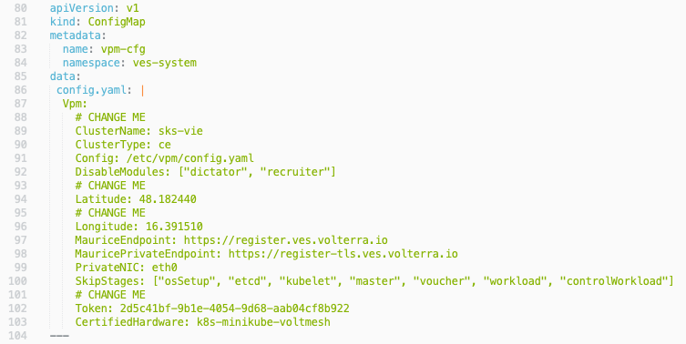

Apply the manifest file:

```
kubectl apply -f ce_k8s.yml
```

Back in the VoltConsole portal, you can now accept or deny the newly created cluster named ```sks-vie```. Navigate to ```System -> Manage -> Site Management -> Registrations```. 

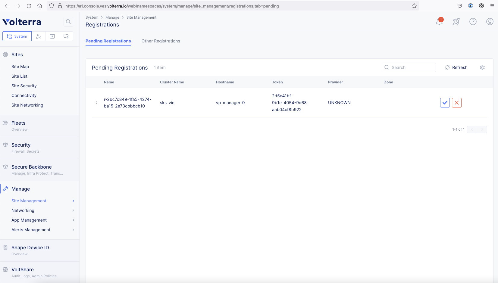

After that, the registration, initialization and upgrading process will start. You will see a window where you can confirm your settings set by the manifest before. Make sure that you will use the Site-to-Site Tunnel Type ```IPSEC or SSL``` for maximum interoperability. 

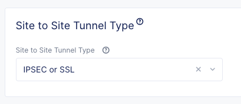

After some time, the new site will be marked healthy in the Site Connectivity page (```System -> Sites -> Connectivity```). Please note that this can take up to 15 minutes due to internal consistency and connectivity checks. 

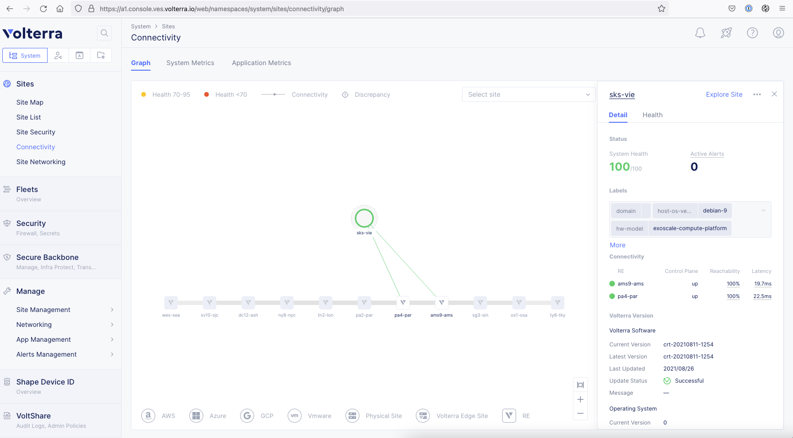

It’s useful to label specific sites or parts of that site so that you can later on reference on these dynamic labels rather than on static site or node names. In our example, we will use the key ```exo-type``` and the value ```sks```. To do so, click on the site in the site connectivity screen, click on the three dots on the upper right to edit this site and add your label. 

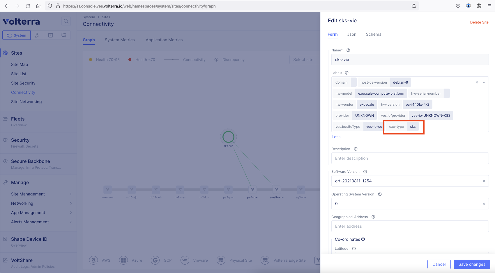

### 4. Enable service discovery

The SKS site is now up and running. As a last step, we need to allow Volterra to discover the pods and services inside the Kubernetes cluster so that we can reference on them in VoltConsole. To do so, we need to create a new or use an existing kubeconfig file with which you can access the desired namespaces and entities. 

Navigate to ```System -> Manage -> App Management``` and add a new Discovery. Add all your information and choose ```K8S Discovery Configuration``` to add your kubeconfig file. 

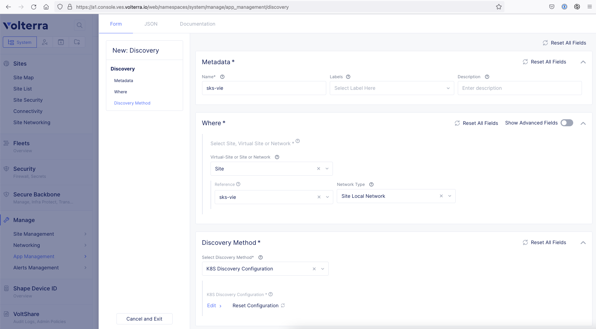

After applying the config, it takes some minutes to discover all services in the SKS cluster. 

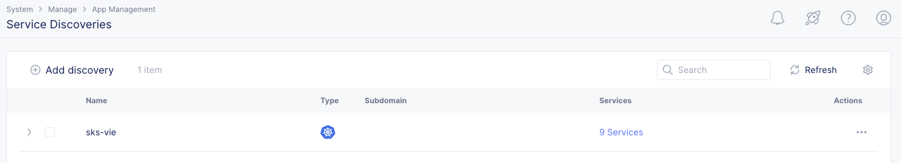

### 5. Deploy the Hackazon app

We can use the following manifest to add the Hackazon web application:

```
apiVersion: v1
kind: Service
metadata:
  name: hackazon
  labels:
    app: hackazon
    service: hackazon
spec:
  ports:
  - port: 80
    name: hackazon-80
    protocol: TCP
    name: http
  selector:
    app: hackazon
---
apiVersion: apps/v1
kind: Deployment
metadata:
  name: hackazon
  labels:
    app: hackazon
    version: v1
spec:
  replicas: 3
  selector:
    matchLabels:
      app: hackazon
      version: v1
  template:
    metadata:
      labels:
        app: hackazon
        version: v1
    spec:
      containers:
      - env:
        - name: service_name
          value: hackazon
        image: santosomar/hackazon:latest
        imagePullPolicy: IfNotPresent
        name: hackazon
        ports:
        - containerPort: 80
          protocol: TCP
```

We should now also see, that the service has been discovered

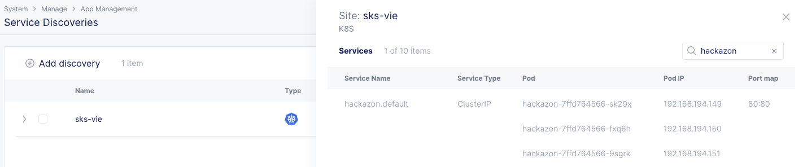


### 6. Create a load balancer to publish the app to the Internet

To publish the Hackazon app to the Internet, we need a load balancer object. We always have the choice between a pure TCP-based and a more-enhanced HTTP-based load balancer. In our case, we will configure a HTTP load balancer which uses the Hackazon app as a so-called ```Origin Pool``` – which is the desired backend the load balancer uses for frontend requests. This Origin Pool will also have a HTTP health check assigned to make sure the 

To add a new health check, navigate to ```App -> Manage -> Load Balancers -> Health Checks``` and add a new HTTP health check with the name ```plain-http```. 


To add a new Origin Pool, navigate to ```App -> Manage -> Load Balancers -> Origin Pools``` and add a new Origin Pool. Use the following settings:

* Type: ```K8s Service Name of Origin Server on give Sites```
* Service Name: ```hackazon.default```
* Site: ```sks-vie```
* Network: ```Outside Network```
* Port: ```80```
* Health Check: ```plain-http```

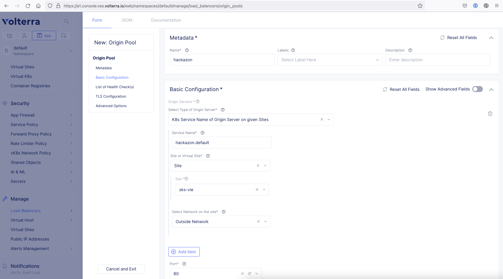

Next, we need a HTTP load balancer. Navigate to ```App -> Manage -> Load Balancers -> HTTP Load Balancers``` and add a load balancer. We can use the following settings:

* Name: ```hackazon```
* Domains: ```hackazon-sks.a1dsec.net```
* Type: ```HTTP```
* Origin Pool: ```default/hackazon```

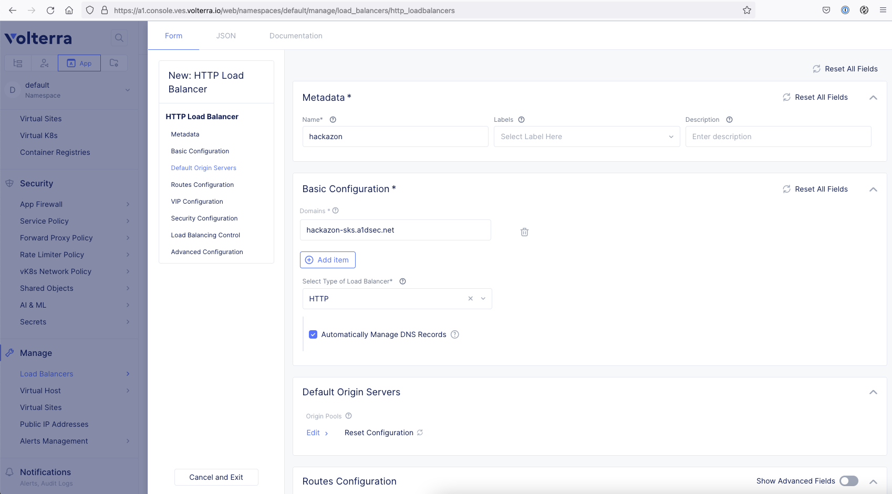

Please note, that in our case we’re using a domain which is fully managed by Volterra. If you use a custom domain outside of Volterra, you will have to update your DNS manually after load balancer deployment.

We can now access the application in the browser:

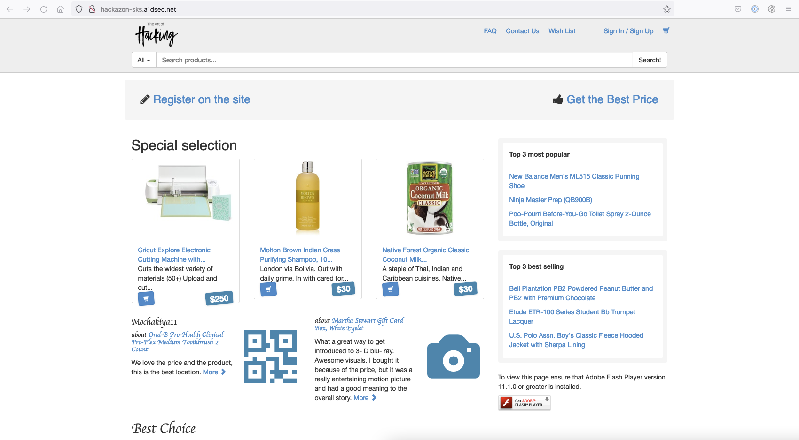

### So, what’s next?

You can now think about:

* Multi-Kubernetes-deployment using VoltMesh as a transparent logical layer in front of your applications
* Intelligent traffic distribution using traffic routes and circuit breaker
* Application security to secure your apps without changing a single piece of software code

Please also see the [second part](volterra-site-kvm.md) of this Volterra deployment series on Exoscale.

## Additional Notice

Please check all script entries of their correctness. The IDs and names used here in the guide are also carefully checked for accuracy. If you have any questions or comments about this guide, please contact [A1 Digital](mailto:vendors.security@a1.digital).